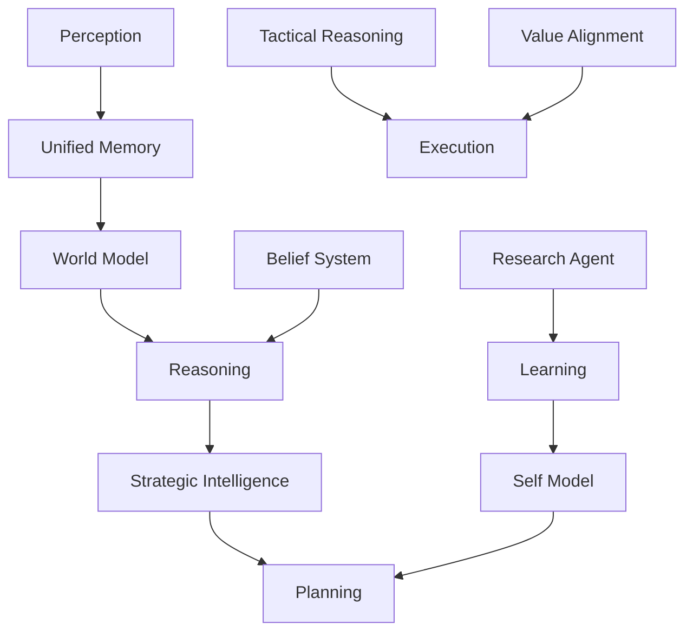

# AGI-1 Cognitive Architecture

```mermaid
graph TD
  Perception[Perception] --> Unified_Memory[Unified Memory]
  Unified_Memory[Unified Memory] --> World_Model[World Model]
  World_Model[World Model] --> Reasoning[Reasoning]
  Reasoning[Reasoning] --> Strategic_Intelligence[Strategic Intelligence]
  Strategic_Intelligence[Strategic Intelligence] --> Planning[Planning]
  Tactical_Reasoning[Tactical Reasoning] --> Execution[Execution]
  Value_Alignment[Value Alignment] --> Execution[Execution]
  Belief_System[Belief System] --> Reasoning[Reasoning]
  Research_Agent[Research Agent] --> Learning[Learning]
  Learning[Learning] --> Self_Model[Self Model]
  Self_Model[Self Model] --> Planning[Planning]
```
